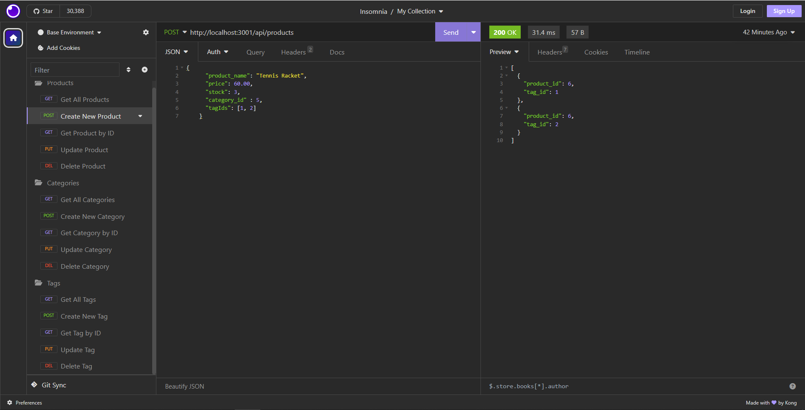

# E-Commerce Backend

## Description

Inventory management for small and medium sized businesses can be a complicated process that takes up resources that would be better utilized in other areas. This backend structure can help organize and catalog stock in a way that is simple and intuitive. It relies on a MySQL database to store product types in different categories with the ability to apply tags to those items for better organization. 

## Installation

N/A

## Usage

Please review the CRUD methods in the .routes/api/ folder. 

https://drive.google.com/file/d/1GYTKqTj_y995aiZh9Bd0CH-SCP6JDlD_/view

## Features

Products can be organized into custom categories.
Tags can be added and removed from products.

